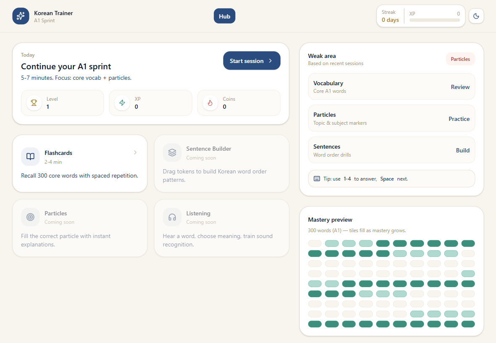
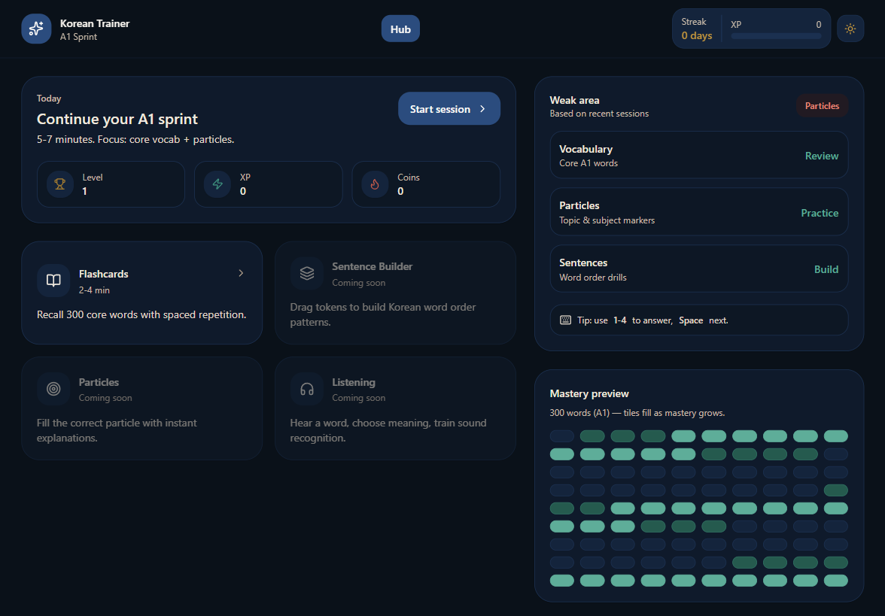

# Project V9 Korea

[](https://github.com/Reterics/project_v9_korea/actions/workflows/build.yml)
[](LICENSE)

Korean A1 learning web app focused on short sessions, vocabulary recall, and game-based practice.

## Preview

| Light | Dark |
|---|---|
|  |  |

## Tech Stack

- React 19 + TypeScript + Vite
- Tailwind CSS 4
- React Router
- Framer Motion + Lucide icons

## Features (Current)

- Learning hub dashboard (`/`)
- Play route for game modules (`/play/:gameId`)
- Flashcards game implemented (`flashcards`)
- Profile, progress, and session state modules
- Seed A1 vocabulary data (`a1-words.json`)

## Project Structure

```text
src/
  app/
    routes/
  features/learn/
    content/
    games/
      _core/
      flashcards/
    profile/
    progress/
    session/
public/
  light.png
  dark.png
docs/
  prompts/
  notes/
  Roadmap.md
```

## Getting Started

```bash
npm install
npm run dev
```

## Scripts

```bash
npm run dev      # start local dev server
npm run build    # type-check + production build
npm run preview  # preview production build
npm run lint     # lint source files
```

## Documentation

- Prompt assets and generation references: `docs/prompts/`
- Notes and learning references: `docs/notes/`
- Product/UX planning docs: `docs/*.md`
