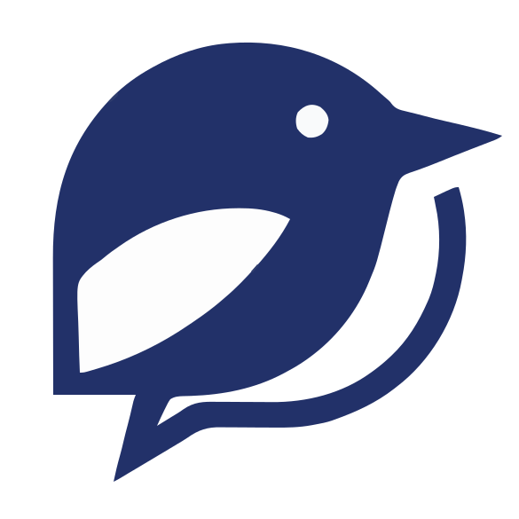
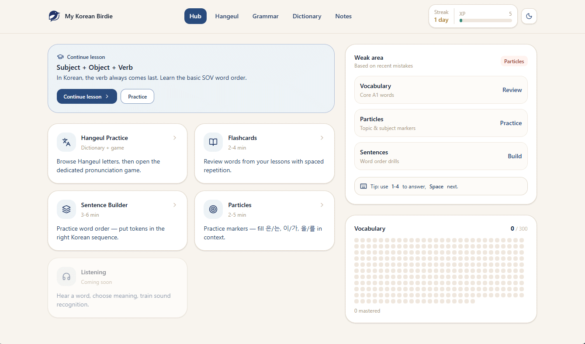

<p align="center">
    <a href="https://github.com/Reterics/project_v9_korea">
        
    </a>
</p>
<h1 align="center">My Korean Birdie</h1>
<div align="center">

[](https://github.com/Reterics/project_v9_korea/actions/workflows/build.yml)
[](LICENSE)

</div>

A Korean language learning web application targeting A1 to A2 proficiency. Built as a monorepo with a shared design system, it combines spaced repetition, grammar drills, and game-based practice into short, focused study sessions.

## Preview



## Tech Stack

- **Runtime**: React 19, TypeScript 5.9, Vite 7
- **Styling**: Tailwind CSS 4, Framer Motion
- **Routing**: React Router 7
- **UI Library**: `@birdie/ui` (in-repo design system)
- **Testing**: Vitest, Playwright, Storybook 10
- **CI/CD**: GitHub Actions

## Features

- **Learning Hub** -- dashboard with progress overview and activity feed
- **Flashcards** -- SRS-driven vocabulary drill across A1/A1+/A2 word sets
- **Particles** -- fast-paced vocabulary recognition game
- **Sentence Builder** -- grammar pattern and word-ordering practice
- **Hangeul Practice** -- Korean alphabet reading and writing drills
- **Grammar Lessons** -- structured lessons with interactive exercises
- **Dictionary** -- searchable vocabulary browser
- **Knowledge Base** -- reference notes and cheat sheets
- **Dark Mode** -- class-based theme with localStorage persistence
- **Responsive Layout** -- bottom navigation on mobile, top navigation on desktop

## Project Structure

```text
project_v9_korea/
  apps/
    web/                        # Main web application
      src/
        app/                    # Shell, routing, providers
        features/
          learn/
            content/            # Curriculum data (JSON + repos)
            games/
              _core/            # Game engine framework
              flashcards/       # Flashcards game
              particles/        # Particles game
              sentence-builder/ # Sentence Builder game
            profile/            # User state & mastery tracking
            progress/           # Metrics & SRS algorithm
            session/            # Study session management
          hangeul/              # Hangeul practice pages
        components/             # App-specific shared components
  packages/
    design-system/              # @birdie/ui component library
      src/
        primitives/             # Button, Card, Badge, Icon, etc.
        components/             # LessonCard, ChoiceGrid, FeedbackToast, etc.
        forms/                  # Input, Select, Checkbox, DatePicker, etc.
        navigation/             # Topbar, Sidebar, BottomNav, Drawer
        icons/                  # BirdIcon, BrandLogo
        patterns/               # DashboardLayout, GameLayout, SplashScreen
        styles/                 # Theme tokens and CSS
  docs/                         # Architecture, roadmap, and design docs
```

## Getting Started

**Prerequisites**: Node.js 20+ and npm.

```bash
# Install dependencies
npm install

# Build the design system (required before first run)
npm run build --workspace=packages/design-system

# Start the dev server
npm run dev
```

## Scripts

```bash
# Development
npm run dev                # Start Vite dev server
npm run storybook          # Start Storybook on port 6006

# Quality
npm run lint               # ESLint
npm run format             # Prettier check
npm run typecheck          # TypeScript across workspaces

# Production
npm run build              # Type-check + production build
npm run preview            # Preview production build
npm run build-storybook    # Build static Storybook
```

## Architecture

The application follows a modular feature-based architecture:

- **Game Engine** -- each game implements `init()`, `reduce(state, action)`, and `buildResult()` functions consumed by a shared `GameHost` controller
- **State Management** -- `useReducer` with custom hooks (`useProfile`, `useGameController`, `useStudySession`)
- **Data Layer** -- localStorage-backed repositories for profile, progress, and content
- **Spaced Repetition** -- scheduling algorithm in `progress/srs.ts` drives review intervals
- **Design System** -- Vite library build exports components and a Tailwind theme consumed via `@birdie/ui`

## Design System

The `@birdie/ui` package provides a Korean-inspired "Korean Notebook" theme with five semantic color scales:

| Token       | Name          | Usage             |
|-------------|---------------|-------------------|
| `namsaek`   | Korean Indigo | Primary actions   |
| `cheongja`  | Celadon Green | Success / mastery |
| `dancheong` | Coral Red     | Errors            |
| `geum`      | Gold          | XP / rewards      |
| `hanji`     | Warm Paper    | Backgrounds       |

## Documentation

Detailed design and planning documents are available in `docs/`:

- `react-component-architecture-design.md` -- component layering and game engine patterns
- `mini-games.md` -- game design specifications
- `design-system.md` -- full design system specification
- `roadmap.md` -- 90-day development plan
- `grammar-first-learning-plan.md` -- curriculum design
- `ui-design-direction.md` -- visual design guidelines

## License

[MIT](LICENSE)
