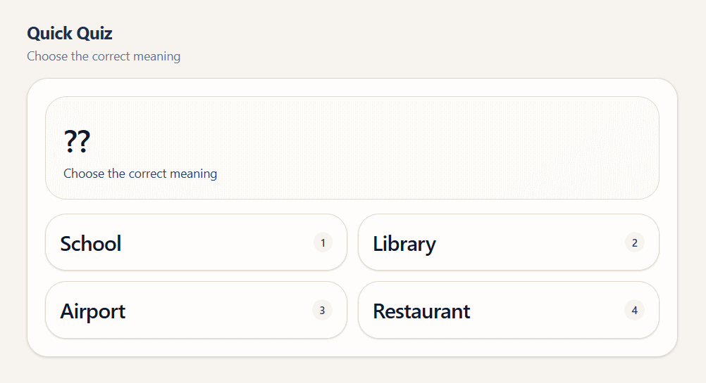

<p align="center">
  
</p>

<h1 align="center">@reterics/birdie-ui</h1>

<p align="center">
  <a href="https://www.npmjs.com/package/@reterics/birdie-ui"></a>
  <a href="https://www.npmjs.com/package/@reterics/birdie-ui"></a>
  <a href="https://reterics.github.io/project_v9_korea/design_system/"></a>
  <a href="https://github.com/Reterics/project_v9_korea/actions/workflows/build.yml"></a>
  <a href="https://github.com/Reterics/project_v9_korea/blob/main/LICENSE"></a>
</p>

Tailwind CSS v4 based design system for learning and productivity products, with reusable primitives, composed components, layout patterns, and theme tokens.

## Installation

```bash
npm install @reterics/birdie-ui
```

## Peer Dependencies

```bash
npm install react react-dom framer-motion lucide-react
```

## Usage

```tsx
import { Button, Card } from "@reterics/birdie-ui";
import "@reterics/birdie-ui/theme";

export function Example() {
  return (
    <Card>
      <Button variant="primary">Continue</Button>
    </Card>
  );
}
```

## Quick Bootstrap (Quiz Scaffold)

1. Create a React app (Vite recommended).
2. Install this package and peer dependencies.
3. Import `@reterics/birdie-ui/theme` once in your app entry (`main.tsx` or `index.tsx`).
4. Build your first screen with `Container`, `PageHeader`, `Card`, `PromptCard`, and `ChoiceGrid`.

```tsx
import { useState } from "react";
import {
  Container,
  PageHeader,
  Card,
  PromptCard,
  ChoiceGrid,
  FeedbackToast,
} from "@reterics/birdie-ui";

const options = ["School", "Library", "Airport", "Restaurant"];

export function QuizGamePage() {
  const [toastType, setToastType] = useState<"correct" | "wrong" | null>(null);

  return (
    <Container className="space-y-4">
      <PageHeader title="Quick Quiz" description="Choose the correct meaning" />
      <Card className="space-y-4">
        <PromptCard text="??" subtitle="Choose the correct meaning" />
        <ChoiceGrid
          choices={options.map((label) => ({ value: label, label }))}
          onSelect={(value) => setToastType(value === "School" ? "correct" : "wrong")}
        />
      </Card>
      <FeedbackToast type={toastType} />
    </Container>
  );
}
```

<p>
  
</p>


## Theme Override

Override CSS variables after importing `@reterics/birdie-ui/theme`.

Base color token scales:
- `--color-namsaek-*` (primary)
- `--color-cheongja-*` (success)
- `--color-dancheong-*` (error)
- `--color-geum-*` (accent/reward)
- `--color-hanji-*` (neutral/background)

```css
:root {
  --color-namsaek-500: #1f3f74;
  --color-cheongja-500: #2f7f6d;
  --color-dancheong-500: #b84a3e;
  --color-geum-500: #8f6b25;
  --color-hanji-100: #f4efe7;
}

.dark {
  --color-namsaek-900: #0c1524;
  --color-hanji-200: #d8cec0;
}
```

## Notes

- SSR frameworks (for example Next.js) should import `@reterics/birdie-ui/theme` from a top-level client entry/layout.
- Keep `react` and `react-dom` as app-owned dependencies to avoid duplicate React instances.

## Assets

```ts
import logoUrl from "@reterics/birdie-ui/assets/brand/logo-primary.svg";
```

## Repository

- Source: https://github.com/Reterics/project_v9_korea/tree/main/packages/design-system
- Issues: https://github.com/Reterics/project_v9_korea/issues
